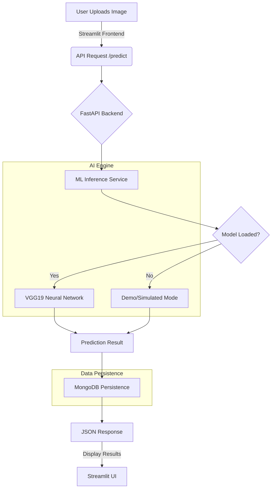

<p align="center">
  
  
  
  
  
</p>

<h1 align="center">🔬 VitaminVision</h1>
<p align="center">
  <strong>Production-Grade AI Nutrient Detection System</strong><br/>
  <i>Bridging the gap between computer vision and nutritional awareness.</i>
</p>

---

## 🌟 Overview

**VitaminVision** is an advanced AI-powered platform designed to identify the dominant vitamin profiles in food items through simple image analysis. By leveraging state-of-the-art Deep Learning (VGG19 Transfer Learning), the system provides users with immediate nutritional insights, health benefits, and recommended daily values.

Originally conceived as a monolithic Streamlit application, the project has evolved into a robust, **Decoupled Microservices Architecture** to ensure scalability, performance, and maintainability.

---

## 🗺️ System Flow Roadmap

The following diagram illustrates the complete end-to-end flow of a prediction request, from the user's interface to the database persistence layer.



---

## 🚀 Key Features

-   **🧠 Intelligent Classification**: Uses a VGG19-based Convolutional Neural Network (CNN) to classify food images into 5 major vitamin categories (A, B, C, D, E).
-   **⚡ Decoupled Architecture**: High-performance FastAPI backend separated from the interactive Streamlit frontend.
-   **📊 Real-time Analytics**: Instant confidence scoring and detailed nutritional data for every prediction.
-   **📂 Historical Tracking**: All predictions are asynchronously logged to **MongoDB Atlas**, allowing users to review their nutritional history.
-   **🛡️ Robust Validation**: Strict data integrity enforced through Pydantic v2 schemas.
-   **🔄 Singleton Model Management**: Optimized startup performance by loading the heavy ML model only once into memory.

---

## 🛠️ Modern Tech Stack

| Layer | Technology | Rationale |
| :--- | :--- | :--- |
| **Frontend** | Streamlit | Rapid development of modern, interactive UI for AI apps. |
| **Backend API** | FastAPI | High-performance, asynchronous web framework with auto OpenAPI docs. |
| **AI Model** | TensorFlow / Keras | Industry-standard library for building and deploying Deep Learning models. |
| **CNN Base** | VGG19 | Proven architecture for complex image feature extraction. |
| **Database** | MongoDB Atlas | Scalable, NoSQL cloud storage for flexible prediction logging. |
| **Async DB** | Motor | Asynchronous driver for non-blocking database operations. |
| **Validation** | Pydantic v2 | Type-safe data validation and settings management. |
| **Legacy Web** | Flask | Original monolithic implementation for local development. |

---

## 📁 Project Architecture

```bash
VitaminVision/
├── backend/                  # Modern FastAPI Backend Service
│   ├── app/
│   │   ├── main.py           # Application entry point & Lifespan
│   │   ├── routes/           # REST Endpoints (/predict, /history)
│   │   ├── services/         # ML Inference logic (MLService)
│   │   ├── db/               # MongoDB connection (Motor)
│   │   ├── models/           # Domain Data Models
│   │   └── schemas/          # Pydantic Request/Response Models
│   └── .env                  # Configuration (DB URIs, Model Paths)
│
├── streamlit_app.py          # Modern Streamlit Frontend Client
├── models/                   # AI Model storage (.h5 files)
├── notebooks/                # Model Training & EDA (VGG19)
├── 1. Project Initialization/# Phase 1: Planning & Setup
├── 2. Data Collection/       # Phase 2: Dataset Curating
├── 3. Model Development/      # Phase 3: CNN Training
├── 4. Model Optimization/    # Phase 4: Tuning & Metrics
├── 5. Project Executable/    # Phase 5: Build Artifacts
├── 6. Documentation/         # Phase 6: Demos & Guides
├── app.py                    # Legacy Flask Monolith Entry Point
├── templates/                # Legacy HTML Templates
└── static/                   # Static Assets (CSS, JS, Images)
```

---

## ⚙️ Installation & Setup

### Prerequisites
- Python 3.10+
- MongoDB Atlas Account (or local MongoDB instance)
- Trained `my_model.h5` placed in the `models/` directory.

### 1. Backend Configuration
1. Navigate to the backend directory:
   ```bash
   cd backend
   ```
2. Install dependencies:
   ```bash
   pip install -r requirements.txt
   ```
3. Create a `.env` file based on the environment needs:
   ```env
   MONGODB_URI=your_mongodb_atlas_connection_string
   DATABASE_NAME=vitamin_vision
   MODEL_PATH=../models/my_model.h5
   ```
4. Start the FastAPI server:
   ```bash
   uvicorn app.main:app --reload
   ```

### 2. Frontend Launch
1. Open a new terminal in the project root.
2. Install dependencies (if not already done):
   ```bash
   pip install -r requirements.txt
   ```
3. Run the Streamlit application:
   ```bash
   streamlit run streamlit_app.py
   ```

---

## 🧠 Model Deep-Dive

The core of VitaminVision is a **VGG19** architecture fine-tuned for nutritional classification.

-   **Input Layer**: 224x224 RGB Images.
-   **Transfer Learning**: The model uses pre-trained weights from ImageNet for base feature extraction.
-   **Custom Head**: Fully connected layers with Dropout (0.5) to prevent overfitting, followed by a Softmax output layer.
-   **Preprocessing**: Images are normalized (1/255.0) and resized before inference.
-   **Classes**: Vitamin A (🥕), Vitamin B (🌾), Vitamin C (🍊), Vitamin D (☀️), Vitamin E (🥜).

---

## 🛣️ Future Roadmap

-   [ ] **Mobile App**: Native Android/iOS version using Flutter or React Native.
-   [ ] **Real-time Video Scanning**: Scan food items live using a camera feed.
-   [ ] **User Accounts**: personalized profiles to track long-term nutritional intake.
-   [ ] **Ingredient Breakdown**: Expand detection to specific food ingredients and calories.
-   [ ] **API Integration**: Connect with fitness trackers like MyFitnessPal.

---

## 👥 Credits & Attribution

-   **Development**: Built with ❤️ by Adarsh Singh and team.
-   **Research**: Specialized dataset collected and curated for nutritional classification.
-   **University**: Supported by VIT University, Vellore.

---

<p align="center">
  Developed with <b>Modern AI Best Practices</b>
</p>
